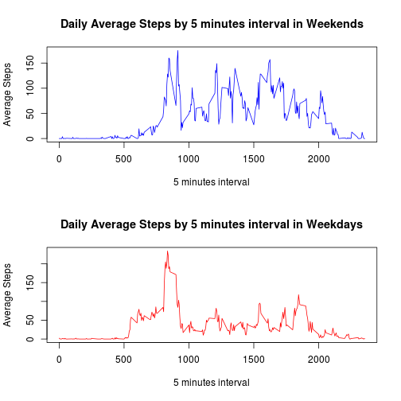

# Reproducible Research: Peer Assessment 1


## Loading and preprocessing the data


```r
Sys.setlocale("LC_TIME", "en_US.UTF-8")
```

```
## [1] "en_US.UTF-8"
```

```r
activityOriginal <- read.csv('activity.csv',stringsAsFactors = F);
activityDF <- activityOriginal[complete.cases(activityOriginal),];
activityDF$date <- as.Date(activityDF$date, format = "%Y-%m-%d");
perDayDF <- aggregate(activityDF$steps, by=list(date = activityDF$date), FUN=sum);
colnames(perDayDF) <- c("date","steps");

avgPerInterval <- aggregate(activityDF$steps, by=list(interval = activityDF$interval), FUN=mean);

colnames(avgPerInterval) <- c("interval","meanSteps");
maxInterval <- avgPerInterval[order(avgPerInterval$meanSteps, decreasing=TRUE), ][1,];
```


## What is mean total number of steps taken per day?


```r
 hist(perDayDF$steps,main="Steps by Day",
       xlab="Number of steps")
```

 

The mean steps taken per day is:


```r
mean(perDayDF$steps);
```

```
## [1] 10766
```

The median steps taken per day is:


```r
median(perDayDF$steps);
```

```
## [1] 10765
```


## What is the average daily activity pattern?


```r
 plot(avgPerInterval$interval,avgPerInterval$meanSteps,col="black", type="l",
       main="Daily Average Steps by 5 minutes interval",
       ylab="Average Steps",
       xlab="5 minutes interval")
```

 

The 5-minute interval, on average across all the days in the dataset, that contains the maximum number of steps is:


```r
maxInterval$interval
```

```
## [1] 835
```
with 


```r
maxInterval$meanSteps
```

```
## [1] 206.2
```
average steps

## Inputing missing values

I used the average of the interval to fill  missing steps (with NA's)


```r
library(plyr);

missingDF <- ddply(activityOriginal[!complete.cases(activityOriginal),], .(date,interval,steps), transform, steps = round(mean(activityDF$steps[activityDF$interval == interval]), digits = 0));

missingDF$date <- as.Date(missingDF$date, format = "%Y-%m-%d");

completeDF <- rbind(missingDF,activityDF);

completeDF$steps <- as.numeric(completeDF$steps);

perDayCompleteDF <- aggregate(completeDF$steps, by=list(date = completeDF$date), FUN=sum);
colnames(perDayCompleteDF) <- c("date","steps");

hist(perDayCompleteDF$steps,main="Steps by Day (Complete DataFrame)",
       xlab="Number of steps")
```

 


The mean steps taken per day (Complete Data Frame) is:


```r
mean(perDayCompleteDF$steps);
```

```
## [1] 10766
```

With NA's the mean is:


```r
mean(perDayDF$steps);
```

```
## [1] 10766
```


The median steps taken per day (Complete Data Frame) is:


```r
median(perDayCompleteDF$steps);
```

```
## [1] 10762
```

With NA's the mean is:


```r
median(perDayDF$steps);
```

```
## [1] 10765
```


## Are there differences in activity patterns between weekdays and weekends?


```r
require(ggplot2)
```

```
## Loading required package: ggplot2
```

```r
activityDF$wday    <- as.factor(ifelse(weekdays(activityDF$date) %in% c("Saturday","Sunday"), "Weekend", "Weekday")) ;

weekendDF <- subset(activityDF, wday == "Weekend");
weekdayDF <- subset(activityDF, wday == "Weekday");

head(weekendDF);
```

```
##      steps       date interval    wday
## 1441     0 2012-10-06        0 Weekend
## 1442     0 2012-10-06        5 Weekend
## 1443     0 2012-10-06       10 Weekend
## 1444     0 2012-10-06       15 Weekend
## 1445     0 2012-10-06       20 Weekend
## 1446     0 2012-10-06       25 Weekend
```

```r
avgPerIntervalWeekend <- aggregate(weekendDF$steps, by=list(interval = weekendDF$interval), FUN=mean);


colnames(avgPerIntervalWeekend) <- c("interval","meanSteps");

avgPerIntervalWeekday <- aggregate(weekdayDF$steps, by=list(interval = weekdayDF$interval), FUN=mean);
colnames(avgPerIntervalWeekday) <- c("interval","meanSteps");

par(mfrow=c(2,1))

plot(avgPerIntervalWeekend$interval ,avgPerIntervalWeekend$meanSteps ,col="blue", type="l",
       main="Daily Average Steps by 5 minutes interval in Weekends",
       ylab="Average Steps",
       xlab="5 minutes interval");

plot(avgPerIntervalWeekday$interval ,avgPerIntervalWeekday$meanSteps ,col="red", type="l",
       main="Daily Average Steps by 5 minutes interval in Weekdays",
       ylab="Average Steps",
       xlab="5 minutes interval")
```

 


